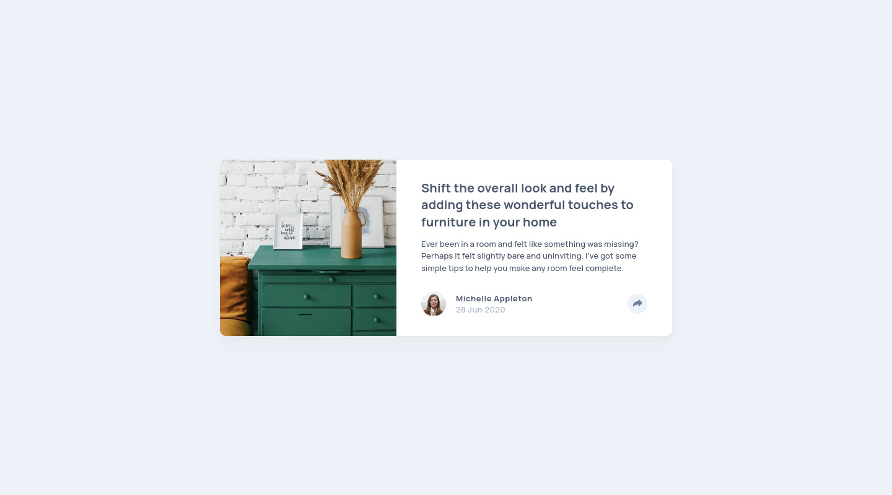

# Frontend Mentor - Article preview component solution

This is a solution to the [Article preview component challenge on Frontend Mentor](https://www.frontendmentor.io/challenges/article-preview-component-dYBN_pYFT). Frontend Mentor challenges help you improve your coding skills by building realistic projects.

## Table of contents

- [Overview](#overview)
  - [The challenge](#the-challenge)
  - [Screenshot](#screenshot)
  - [Links](#links)
- [My process](#my-process)
  - [Built with](#built-with)
  - [Thoughts](#thoughts)
  - [Useful resources](#useful-resources)
- [Author](#author)

## Overview

### The challenge

Users should be able to:

- [x] View the optimal layout for the component depending on their device's screen size
- [x] See the social media share links when they click the share icon

### Screenshot

### Links

- Solution URL: https://www.frontendmentor.io/solutions/article-preview-component-using-web-components-and-floating-ui-WTST1qYtZa
- Live Site URL: https://article-preview-component-fem.netlify.app/

## My process

### Built with

- Semantic HTML5 markup
- CSS custom properties
- Flexbox
- CSS Grid
- Mobile-first workflow
- Web Components
- [Floating UI](https://floating-ui.com/)
- [Styled Components](https://styled-components.com/) - For styles

### Thoughts

Been interested in Web Components for a while now, so I tried using it in this challenge to encapsulate the logic of the share button and tooltip. It worked out pretty well (I think).

I also challenged myself to come up with a solution that doesn't require a build step, which forced me to learn about node module resolution—something I took for granted before. In the end, I used Rollup for bundling (it's not a build step, right?) for node module resolution and JS minification. It isn't as easy as Vite and required me to find and configure plugins that I need, but overall it helped me gain a new perspective on the importance of front-end tooling.

### Useful resources

- [Build a fully-responsive, progressively enhanced burger menu](https://piccalil.li/tutorial/build-a-fully-responsive-progressively-enhanced-burger-menu/)
- [ResizeObserver: it’s like document.onresize for elements](https://web.dev/articles/resize-observer)
- [CSS clip-path maker](https://bennettfeely.com/clippy/)

## Author

- Website - [Josh Javier](https://joshjavier.com/)
- Frontend Mentor - [@joshjavier](https://www.frontendmentor.io/profile/joshjavier)
